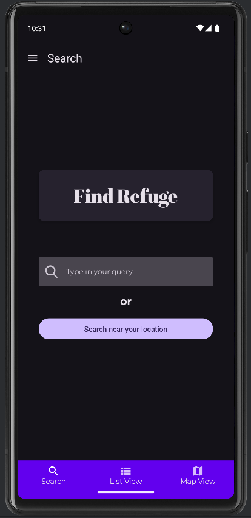
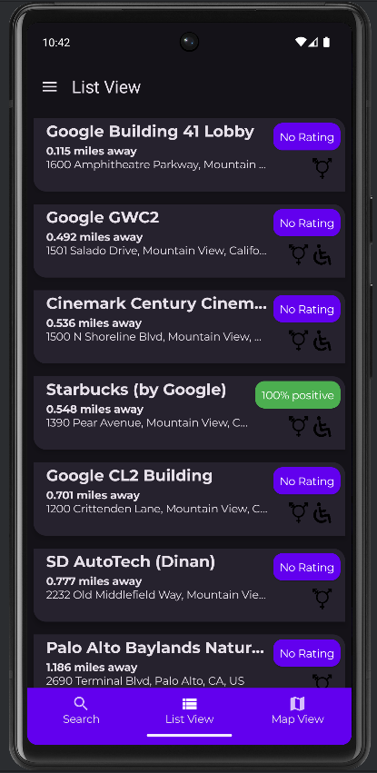
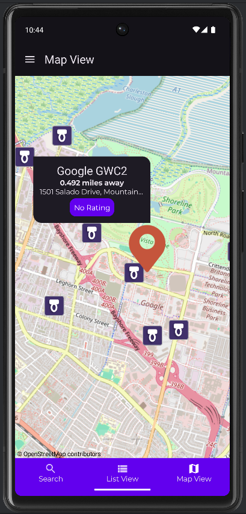

# Refuge Restrooms for Android

<!--  -->

<!--  -->

Android app for [Refuge Restrooms](http://www.refugerestrooms.org/)

## Getting started
You can use [Android Studio](https://developer.android.com/studio/intro) to build this project, and it should behave like any other android studio project.

Clone the repo here and then in Android Studio go to File -> New -> Import Project and navigate to your clone. You may be prompted by Android Studio to install a few sdk dependencies.

## Contributing
By all means contribute :) Areas which definitely need work are listed as TODOs below. Feel free to add more.

Please try to stick to the Android Kotlin [coding guidelines](https://kotlinlang.org/docs/coding-conventions.html) and [guide to app architecture](https://developer.android.com/topic/architecture).

If you push code, please make sure it builds correctly. Feel free to use pull requests so that other contributors can check your code. Also create an issue when working on a new feature so we don't duplicate work!

## Links to Refuge Restrooms project on other platforms

- [Main project Web App](https://github.com/RefugeRestrooms/refugerestrooms)
- [SMS messaging Twilio Application](https://github.com/RefugeRestrooms/refugerest_sms)
- [Android Native Application (Java)](https://github.com/RefugeRestrooms/refugerestrooms-android)
- [iOS Native Application](https://github.com/RefugeRestrooms/refuge-ios)
- [Yo Application](https://github.com/raptortech-js/YoRestrooms)

## Functionality
- Access to the REST API to obtain location data of public toilets.
- Visualization of the data received from the REST API via a dynamic list. Each item is interactive and can be selected in order to show/hide additional information.
- Persistent storage of user preferences. For now, just the user choice between dark and bright theme.
- Visualization on a map of the POIs obtained from the API. These points are interactive and can be selected to show/hide additional information.
- Navigation between screens through a drop-down menu and a bottom navigation bar.  

## Tech

* Kotlin
* Jetpack Compose
* Material Design 3
* Retrofit
* Kotlin-serialization
* OpenStreetMap [(osmdroid)](https://github.com/osmdroid/osmdroid)
* [OpenStreetMap for Android Compose](https://utsmannn.github.io/osm-android-compose/)
* Preferences DataStore

## TODO
- [ ] Create "add bathroom" section
- [ ] Upgrade Scaffold and Buttom Navigation Bar components to Material 3. Current versions are not compatible with Material 3 theming. Quick fix was done calling the theme wrapper around the faulty components. 
- [ ] Add links in "about" screen to GitHub, original project page, pateron...
- [x] Detailed info list window
    - [ ] Allow edit suggestions on restrooms like in web app
    - [ ] Allow users to rate and report bathrooms
    - [ ] Allow users to leave comments on bathrooms like in webapp
- [ ] Add translations
    - [ ] Add more languages
- [x] Search bar
    - [ ] Search by address option -- need to translate address to lat/lng. Query search just filters by name, and seems to overload the API server, so timeout often occurs before response is received
    - [ ] Auto-complete search?
    - [ ] Have filter options for only returning accessible, unisex restrooms
- [ ] Add dynamic list scrolling (as you reach the end of the list, more restrooms are requested to the API and appended to the list when received)

## Video Demo
<!--  -->

    

## Screenshots

    
    
    

